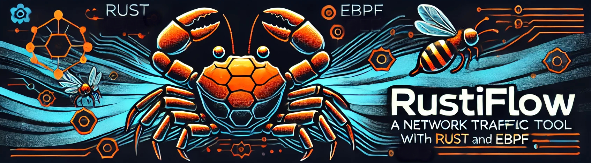
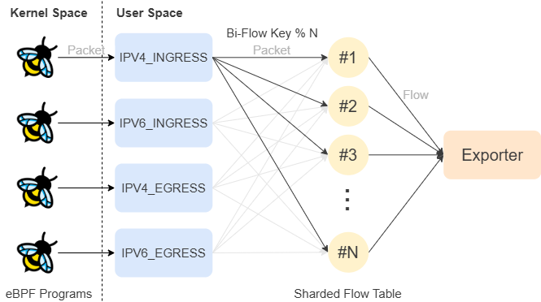
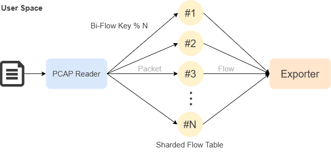

# A Network Traffic Feature Extraction Tool

##  Overview

This tool is engineered for robust and efficient feature extraction, particularly for applications such as network intrusion detection systems, among others. Leveraging Rust language and eBPF, it excels in processing high volumes of network traffic with remarkable speed and throughput. (When your traffic is already captured, don't worry! It also has a build in pcap reader which is also amazingly fast.) With various pre-defined feature sets and the ability to create custom feature sets, RustiFlow offers a versatile solution for network security applications.

<a href="https://github.com/idlab-discover/RustiFlow/actions"></a> 
<a href="https://idlab-discover.github.io/RustiFlow"> </a> <a href="https://github.com/idlab-discover/RustiFlow/blob/main/LICENSE">  </a>

 


##  Key Features

- **High Throughput:** Utilizes Rust and the [Aya](https://aya-rs.dev/) library for eBPF program compilation and execution, ensuring exceptional performance and resource efficiency.
- **Versatile Feature Sets:** Offers a variety of pre-defined feature sets (flows) and the flexibility to create custom feature sets tailored to specific requirements. An example of the custom flow is shown [here](https://github.com/idlab-discover/RustiFlow/blob/main/rustiflow/src/flows/custom_flow.rs).
- **Pcap File Support:** Facilitates packet analysis from pcap files, compatible with both Linux and Windows generated files.
- **Diverse Output Options:** Features can be outputted to the console, a CSV file, or other formats with minimal effort.

## Feature sets

See the [wiki](https://github.com/idlab-discover/RustiFlow/wiki) for the different feature sets available.

##  Architecture

### Realtime processing


### Offline PCAP processing


##  Using the release binary:

Copy the rustiflow binary that you can find in this repo in releases to a location of your choice or to the `/usr/local/bin` folder.
If it does not have the right permissions, you can run the following command:

```bash
chmod +x /path/to/rustiflow
```

### Using commands:

You can then run the binary with the following commands displayed on the [help menu](#usage-instructions).

### Using the tui interface:

If you want a more graphical interface, you can use the tui interface by just running `rustiflow` without any arguments. This will open a field where you can enter a configuration file you want to edit or you can choose to start new. After that, the following interface will show up:


> **NOTE:** When using the save button, you will be prompted for a filename. You can reuse this file with following command:
  ```bash
  rustiflow --config-file <filename> realtime <interface> [--only-ingress]
  ```

  ```bash
  rustiflow -c <filename> pcap <path to pcap file>
  ```
> After saving the configuration file, you can safely reset without changing the configuration file.

### Using the configuration file:
This is an example of a configuration file that you can use to run the tool with the `--config-file` option.

```toml
[config]
features = "CIDDS"
active_timeout = 522
idle_timeout = 885855
early_export = 25
expiration_check_interval = 0

[output]
output = "Csv"
export_path = "path/to/output.csv"
header = false
drop_contaminant_features = true
```
Example 2:
```toml
[config]
features = "Nfstream"
active_timeout = 3600
idle_timeout = 120
early_export = 10
expiration_check_interval = 60
threads = 8

[output]
output = "Print"
header = true
drop_contaminant_features = false
```

##  Using the Container:

Make sure that you don't use docker desktop and that you don't have it installed on your machine. If you have this setup, it will not work as intended as the `--network host` will not link the container to the host network, but to the network of a VM that docker desktop uses.

- **Build the Container**:
  ```bash
  docker build -t rustiflow .
  ```
- **Run the Container**:
  ```bash
  docker run --network host -v /path/on/host:/app rustiflow [ARGS like you are used to]
  ```
  Run it with the --privileged flag if you want to capture traffic in real-time.
- **Example**:
  ```bash
  docker run --network host -v /home/user/pcap:/app rustiflow pcap basic-flow 60 /app/pcap.pcap print
  ```
  ```bash
  docker run --privileged --network host -v /home/matisse/Documents:/app rustiflow realtime enp5s0 cic-flow 60 csv /app/output.csv
  ```

##  Installation Guide for development

### Prerequisites:
- **libpcap-dev**:
  ```sh
  sudo apt install libpcap-dev
  ```
- **Rust Installation**:
  ```bash
  curl --proto '=https' --tlsv1.2 -sSf https://sh.rustup.rs | sh
  ```
- **Nightly Rust Toolchain**:
  ```bash
  rustup install stable
  rustup toolchain install nightly --component rust-src
  ```

### bpf Linker Installation:
- **For Linux x86_64**:
  ```bash
  cargo install bpf-linker
  ```
- **For MacOS/Linux (Other Architectures)**:
  ```bash
  brew install llvm
  cargo install --no-default-features bpf-linker
  ```
- **Ubuntu 20.04 LTS Specific**:
  ```bash
  sudo apt install linux-tools-5.8.0-63-generic
  export PATH=/usr/lib/linux-tools/5.8.0-63-generic:$PATH
  ```

##  Building the Project

- **eBPF Programs**:
  ```bash
  cargo xtask ebpf-ipv4
  cargo xtask ebpf-ipv6
  ```
- **User Space Programs**:
  ```bash
  cargo build
  ```

## Running the Project in dev mode

  ```bash
  cargo xtask run -- [OPTIONS] <COMMAND>
  ```

##  Usage Instructions

### Command Help:
  ```bash
  rustiflow help
  ```
  ```bash
  Usage: rustiflow [OPTIONS] <COMMAND>

  Commands:
    realtime  Real-time feature extraction
    pcap      Feature extraction from a pcap file
    help      Print this message or the help of the given subcommand(s)

  Options:
    -c, --config-file <CONFIG_FILE>
            Configuration file path

    -f, --features <FEATURES>
            The feature set to use (required if no config file is provided)

            Possible values:
            - basic:    A basic flow that stores the basic features of a flow
            - cic:      Represents the CIC Flow, giving 83 features
            - cidds:    Represents the CIDDS Flow, giving 10 features
            - nfstream: Represents a nfstream inspired flow, giving 69 features
            - ntl:      Represents the NTL Flow, giving 120 features
            - custom:   Represents a flow that you can implement yourself

        --active-timeout <ACTIVE_TIMEOUT>
            The maximum time a flow is allowed to last in seconds (optional)
            
            [default: 3600]

        --idle-timeout <IDLE_TIMEOUT>
            The maximum time with no packets for a flow in seconds (optional)
            
            [default: 120]

        --early-export <EARLY_EXPORT>
            The print interval for open flows in seconds (optional)

        --expiration-check-interval <EXPIRATION_CHECK_INTERVAL>
            Interval (in seconds) for checking and expiring flows in the flowtable. This represents how often the flowtable should be scanned to remove inactive flows
            
            [default: 60]

        --threads <THREADS>
            The numbers of threads to use for processing packets (optional) (default: number of logical CPUs)

        -o, --output <OUTPUT>
                Output method (required if no config file is provided)

                Possible values:
                - print: The output will be printed to the console
                - csv:   The output will be written to a CSV file

            --export-path <EXPORT_PATH>
                File path for output (used if method is Csv)

            --header
                Whether to export the feature header

            --drop-contaminant-features
                Whether to drop contaminant features

        -h, --help
                Print help (see a summary with '-h')

        -V, --version
                Print version

  ```

## Logging in both development or using the binary

### Development

```bash
RUST_LOG=info cargo xtask run --
```

### Binary

```bash
sudo RUST_LOG=info rustiflow
```

**Note:** For specific logging levels, adjust `RUST_LOG` to `error` for error messages, and `debug` for debug messages. If you don't want any additional logs, just remove `RUST_LOG=info`.

---
