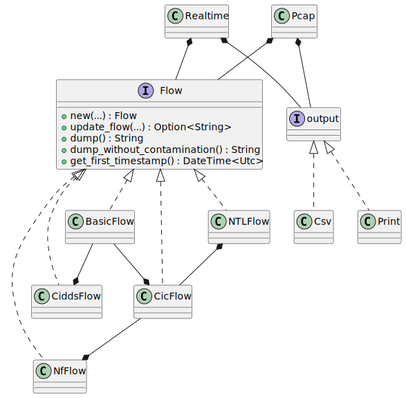

# RustiFlow: A NIDS Feature Extraction Tool


## Overview

This tool is designed for robust and efficient feature extraction in network intrusion detection systems. Leveraging Rust language and eBPF, it excels in processing high volumes of network traffic with remarkable speed and throughput. (When your traffic is already captured, don't worry! It also has a build in pcap reader.) With various pre-defined feature sets and the ability to create custom feature sets, RustiFlow offers a versatile solution for network security applications.

    


## Key Features

- **High Throughput:** Utilizes Rust and the [Aya](https://aya-rs.dev/) library for eBPF program compilation and execution, ensuring exceptional performance and resource efficiency.
- **Versatile Feature Sets:** Offers a variety of pre-defined feature sets (flows) and the flexibility to create custom feature sets tailored to specific requirements.
- **Pcap File Support:** Facilitates packet analysis from pcap files, compatible with both Linux and Windows generated files.
- **Diverse Output Options:** Features can be outputted to the console, a CSV file, or other formats with minimal effort.

## Feature sets

See the wiki for the different feature sets available.

## Architecture



## Using the release binary:

Copy the rustiflow binary that you can find in this repo in releases to a location of your choice or to the `/usr/local/bin` folder.
If it does not have the right permissions, you can run the following command:

```bash
chmod +x /path/to/rustiflow
```

You can then run the binary with the following commands:

See the [help menu](#usage-instructions) for the different options available.

```bash
RUST_LOG=info rustiflow pcap basic-flow 60 /path/to/pcap.pcap print
```

```bash
sudo RUST_LOG=info rustiflow realtime enp5s0 cic-flow 60 csv /path/to/output.csv
```

## Using the Container:

Make sure that you don't use docker desktop and that you don't have it installed on your machine. If you have this setup, it will not work as intended as the `--network host` will not link the container to the host network, but to the network of a VM that docker desktop uses.

- **Build the Container**:
  ```bash
  docker build -t rustiflow .
  ```
- **Run the Container**:
  ```bash
  docker run --network host -v /path/on/host:/app rustiflow [ARGS like you are used to]
  ```
  Run it with the --privileged flag if you want to capture traffic in real-time.
- **Example**:
  ```bash
  docker run --network host -v /home/user/pcap:/app rustiflow pcap basic-flow 60 /app/pcap.pcap print
  docker run --privileged --network host -v /home/matisse/Documents:/app rustiflow realtime enp5s0 cic-flow 60 csv /app/output.csv
  ```

## Installation Guide for development

### Prerequisites:
- **libpcap-dev**:
  ```sh
  sudo apt install libpcap-dev
  ```
- **Rust Installation**:
  ```bash
  curl --proto '=https' --tlsv1.2 -sSf https://sh.rustup.rs | sh
  ```
- **Nightly Rust Toolchain**:
  ```bash
  rustup install stable
  rustup toolchain install nightly --component rust-src
  ```

### bpf Linker Installation:
- **For Linux x86_64**:
  ```bash
  cargo install bpf-linker
  ```
- **For MacOS/Linux (Other Architectures)**:
  ```bash
  brew install llvm
  cargo install --no-default-features bpf-linker
  ```
- **Ubuntu 20.04 LTS Specific**:
  ```bash
  sudo apt install linux-tools-5.8.0-63-generic
  export PATH=/usr/lib/linux-tools/5.8.0-63-generic:$PATH
  ```

## Building the Project

- **eBPF Programs**:
  ```bash
  cargo xtask ebpf-ipv4
  cargo xtask ebpf-ipv6
  ```
- **User Space Programs**:
  ```bash
  cargo build
  ```

## Usage Instructions

### Real-Time Traffic Capture:
- **Command Help**:
  ```bash
  RUST_LOG=info cargo xtask run -- realtime --help
  ```
  ```bash
  Real-time feature extraction

  Usage: rustiflow realtime [OPTIONS] <INTERFACE> <FLOW_TYPE> <LIFESPAN> <METHOD> [EXPORT_PATH]

  Arguments:
    <INTERFACE>
            The network interface to capture packets from

    <FLOW_TYPE>
            Possible values:
            - basic-flow:  A basic flow that stores the basic features of a flow
            - cic-flow:    Represents the CIC Flow, giving 83 features
            - cidds-flow:  Represents the CIDDS Flow, giving 10 features
            - nf-flow:     Represents a nfstream inspired flow, giving 69 features
            - ntl-flow:    Represents the NTL Flow, giving 120 features
            - custom-flow: Represents a flow that you can implement yourself

    <LIFESPAN>
            The maximum lifespan of a flow in seconds

    <METHOD>
            Output method

            Possible values:
            - print: The output will be printed to the console
            - csv:   The output will be written to a CSV file

    [EXPORT_PATH]
            File path for output (used if method is Csv)

  Options:
    -n, --no-contaminant-features
            Whether not to include contaminant features

    -f, --feature-header
            Whether to add the header

    -o, --only-ingress
            Only ingress traffic will be captured

        --interval <INTERVAL>
            The print interval for open flows in seconds, needs to be smaller than the flow maximum lifespan

    -h, --help
            Print help (see a summary with '-h')
  ```

### Reading from a Pcap File:

- **Command Help**:
  ```bash
  RUST_LOG=info cargo xtask run -- pcap --help
  ```
  ```bash
  Feature extraction from a pcap file

  Usage: rustiflow pcap [OPTIONS] <FLOW_TYPE> <LIFESPAN> <PATH> <METHOD> [EXPORT_PATH]

  Arguments:
    <FLOW_TYPE>
            Possible values:
            - basic-flow:  A basic flow that stores the basic features of a flow
            - cic-flow:    Represents the CIC Flow, giving 83 features
            - cidds-flow:  Represents the CIDDS Flow, giving 10 features
            - nf-flow:     Represents a nfstream inspired flow, giving 69 features
            - ntl-flow:    Represents the NTL Flow, giving 120 features
            - custom-flow: Represents a flow that you can implement yourself

    <LIFESPAN>
            The maximum lifespan of a flow in seconds

    <PATH>
            The relative path to the pcap file

    <METHOD>
            Output method

            Possible values:
            - print: The output will be printed to the console
            - csv:   The output will be written to a CSV file

    [EXPORT_PATH]
            File path for output (used if method is Csv)

  Options:
    -n, --no-contaminant-features
            Whether not to include contaminant features

    -f, --feature-header
            Whether to add the header

    -h, --help
            Print help (see a summary with '-h')

  ```

**Note:** For specific logging levels, adjust `RUST_LOG` to `error` for error messages, and `debug` for debug messages. If you don't want any additional logs, just remove `RUST_LOG=info`.

---
